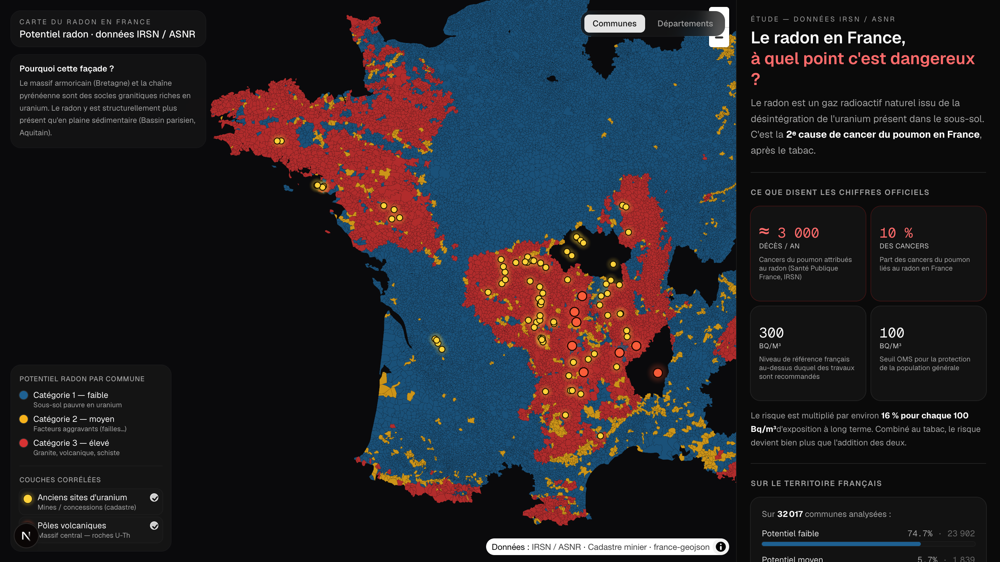
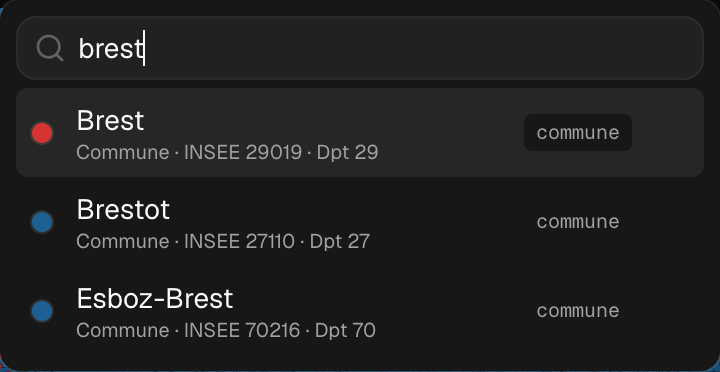
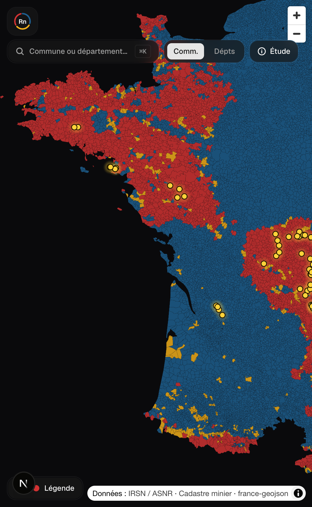

# Radon FR — Carte du potentiel radon en France

> Visualisation interactive du potentiel radon par commune en France, à partir des données ouvertes de l'IRSN / ASNR.
>
> **À quel point c'est dangereux ? Quelles régions sont touchées ? Pourquoi la façade Bretagne → Pays Basque ?**

[](https://app-six-pi-40.vercel.app)
[](https://github.com/kour0/radon-fr/actions)
[](./LICENSE)
[](https://nextjs.org/)
[](https://www.data.gouv.fr/datasets/connaitre-le-potentiel-radon-de-ma-commune/)



---

## Pourquoi ce projet

Le radon est un gaz radioactif naturel issu de la désintégration de l'uranium dans le sous-sol. C'est la **2ᵉ cause de cancer du poumon en France** (≈ 3 000 décès / an, ~10 % des cancers du poumon — *Santé publique France, IRSN*). Sur Internet, on trouve plusieurs cartes contradictoires.

L'app **s'appuie uniquement sur les données officielles publiées par l'IRSN / ASNR sur data.gouv.fr** et permet de :

- Voir au niveau **commune** ou **département** le potentiel radon (catégories 1 / 2 / 3 de l'IRSN)
- Activer des **couches corrélées** : 87 anciens sites uranifères (cadastre minier) + 8 centres volcaniques du Massif central
- **Rechercher** une commune ou un département (32 103 entrées indexées, accent-insensible, ⌘K)
- **Cliquer** une zone pour son détail (popup + sidebar éditoriale)

## Captures

| Recherche communes & départements | Mobile |
| :--- | :--- |
|  |  |

## Stack

- **Next.js 16** App Router + **React 19** + **TypeScript** (statique, prérendu)
- **Tailwind CSS v4** + **shadcn/ui** (new-york, Geist Sans/Mono, dark)
- **MapLibre GL JS** — moteur cartographique vectoriel, sans clé API
- **cmdk** (via shadcn `Command`) pour la palette de recherche
- **Vercel** pour l'hébergement (CDN statique)

## Données

Toutes les données sont sous **licence ouverte** et téléchargées par le pipeline (`pnpm data`).

| Jeu de données | Source | Licence | Utilisation |
| :--- | :--- | :--- | :--- |
| Potentiel radon par commune | [IRSN / ASNR](https://www.data.gouv.fr/datasets/connaitre-le-potentiel-radon-de-ma-commune/) | Licence Ouverte 2.0 | Catégorie 1/2/3 par code INSEE |
| Contours communes & départements | [france-geojson](https://github.com/gregoiredavid/france-geojson) | Domaine public | Géométries simplifiées |
| Cadastre minier | [Camino — Min. Transition écologique](https://www.data.gouv.fr/datasets/cadastre-minier/) | Licence Ouverte 2.0 | Anciens sites uranifères |
| Centres volcaniques | Curation manuelle d'après [BRGM](https://infoterre.brgm.fr) 1/1M + Wikipédia | — | Massif central |

## Démarrer en local

```bash
pnpm install
pnpm data       # télécharge les données brutes + génère les GeoJSON dérivés
pnpm dev        # http://localhost:3000
```

> Les artefacts dérivés (`public/data/*.geojson`, `*.json`) sont **versionnés** pour permettre un clone immédiat sans réseau. Le pipeline n'est nécessaire que pour mettre à jour les données.

## Pipeline de données

```text
data/                              public/data/
├── radon-irsn.csv                 ├── communes.geojson      (commune + cat radon, ~10 MB)
├── communes.geojson    ──┐        ├── departements.geojson  (dept + stats agrégées)
├── departements.geojson  │   ┌──> ├── stats.json            (stats nationales + top dept)
└── cadastre-minier.csv ──┘   │    ├── search-index.json     (32 103 entrées indexées)
                              │    ├── uranium.geojson       (87 points)
                              │    └── volcanism.geojson     (8 points)
                              │
                  scripts/build-data.mjs
                  scripts/build-overlays.mjs
```

### Commandes utiles

```bash
pnpm dev          # serveur de développement (Turbopack)
pnpm build        # build production statique
pnpm lint         # typecheck TS
pnpm data:fetch   # télécharge les sources brutes (idempotent)
pnpm data:build   # régénère les artefacts dans public/data/
pnpm data         # = fetch + build
```

## Structure

```
.
├── app/                  # Next.js App Router (page.tsx, layout.tsx, icon.svg)
├── components/
│   ├── ui/               # shadcn/ui primitives
│   ├── radon-map.tsx     # carte MapLibre + popups + impérative API focusOn()
│   ├── radon-shell.tsx   # layout responsive (desktop sidebar / mobile Sheet)
│   ├── search-bar.tsx    # Command palette avec index pré-calculé
│   ├── info-panel.tsx    # sidebar éditoriale + dernière sélection
│   ├── legend.tsx        # légende + toggles overlays
│   └── logo.tsx          # logo "Rn" en SVG (3 arcs cat. 1/2/3)
├── lib/stats.ts          # types globaux
├── public/data/          # artefacts versionnés (GeoJSON, JSON)
├── scripts/              # pipelines Node ESM
│   ├── fetch-raw.mjs     # téléchargement idempotent des sources
│   ├── build-data.mjs    # IRSN × géométries → choroplèthe + index
│   └── build-overlays.mjs# cadastre minier × curation → overlays points
└── docs/                 # captures pour le README
```

## Choix techniques notables

- **Choroplèthe à 32k polygones** rendu côté client via MapLibre — pas de tuilage côté serveur. GeoJSON simplifié (5 décimales ≈ 1 m, suffisant) compressé à ~3 MB gzip.
- **Recherche** : un index plat de 32 103 entrées (nom normalisé sans accents + centroïdes lng/lat) est chargé à la demande au premier focus. Le scoring privilégie les préfixes et les départements.
- **Popup MapLibre** stylé via CSS sur `.maplibregl-popup-content` (glass dark) — pas de portail React, donc pas de cascade d'événements.
- **Imperative handle** sur le composant `RadonMap` (`focusOn`) pour que la `SearchBar` puisse déclencher un `flyTo` + popup sans porter l'état de la carte côté parent.
- **Tailwind v4** : tokens via `@theme inline`, dark mode par défaut, font Geist fixée littéralement pour éviter la circularité `var(--font-sans)` détectée à l'init shadcn.

## License

MIT — voir [LICENSE](./LICENSE). Les jeux de données conservent leurs licences respectives (voir tableau ci-dessus).

---

<sub>Built with care · Code review tip : ouvrez `components/radon-map.tsx` pour la pièce maîtresse.</sub>
